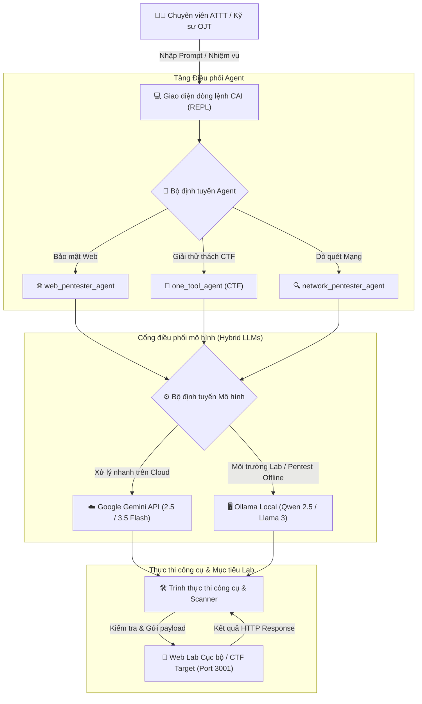

<div align="center">

# CyberAI_OJT 🛡️🤖

**Hệ thống AI Agent Tự động hóa Kiểm thử Bảo mật, Khai thác Lỗ hổng & Giải bài thi CTF**

*Mở rộng và phát triển phục vụ đào tạo thực chiến (OJT), nghiên cứu An toàn thông tin và triển khai mô hình đa LLM (Hybrid Cloud & Local).*

[](https://github.com/HANh965/CyberAI_OJT)
[](https://www.python.org/)
[%20%7C%20WSL2%20%7C%20macOS-lightgrey?style=flat-square)](https://github.com/HANh965/CyberAI_OJT)
[](https://aistudio.google.com/)
[](https://ollama.ai/)
[](LICENSE)

[Tính năng nổi bật](#-tính-năng-cải-tiến-nổi-bật) • [Kiến trúc hệ thống](#️-kiến-trúc-hệ-thống) • [Cài đặt](#-hướng-dẫn-cài-đặt) • [Cách sử dụng](#-hướng-dẫn-sử-dụng) • [Kịch bản mẫu & Prompt](#-kịch-bản-thực-hành-mẫu--prompt) • [Xử lý sự cố](#️-xử-lý-sự-cố-thường-gặp) • [Ghi nhận](#-ghi-nhận--đóng-góp)

</div>

---

## 📌 Giới thiệu tổng quan

**CyberAI_OJT** là nền tảng tự động hóa an toàn thông tin sử dụng AI Agent thế hệ mới, được thiết kế chuyên biệt cho kỹ sư bảo mật, chuyên gia kiểm thử xâm nhập (Pentester) và người chơi giải các thử thách CTF (Capture The Flag).

Dự án hoạt động tối ưu trên **mọi môi trường Linux (Ubuntu, Debian, Kali Linux)** cũng như **Windows (thông qua WSL2)** và macOS. Được xây dựng và phát triển dựa trên nền tảng của framework nghiên cứu mã nguồn mở **CAI (Cybersecurity AI)**, dự án bổ sung thêm các tính năng phù hợp cho quá trình **On-the-Job Training (OJT)**:
- Kết hợp linh hoạt giữa mô hình đám mây tốc độ cao (**Google Gemini**) và mô hình chạy cục bộ an toàn, không bị kiểm duyệt (**Ollama**).
- Tương thích đa nền tảng, hỗ trợ các phiên bản Python hiện đại nhất từ **Python 3.10 đến Python 3.14+**.
- Tự động hóa chu trình phát hiện lỗ hổng Web (như SQL Injection, Command Injection, Authentication Bypass) thông qua quy trình tư duy có cấu trúc TRACE 7 bước.

---

## ✨ Tính năng cải tiến nổi bật

### 1. 🧠 Cơ chế Hybrid Multi-LLM (Cloud kết hợp Local)
- **Tích hợp Google Gemini (AI Studio):**
  - Hỗ trợ toàn diện các dòng model tiên tiến nhất: `gemini-2.5-flash`, `gemini-3.5-flash`, và `gemini-3.1-flash-lite`.
  - **Tự động tối ưu Token Cache:** Tự động loại bỏ các khối `cache_control` khi gọi API Gemini, giúp loại trừ hoàn toàn lỗi `429 Too Many Requests (TotalCachedContentStorageTokensPerModelFreeTier: limit=0)` trên các tài khoản Google AI Studio miễn phí (Free Tier).
- **Mô hình cục bộ qua Ollama (Local LLMs):**
  - Kết nối mượt mà với các model offline như `qwen2.5:7b`, `llama3.1:8b`.
  - **Không bị chặn bởi bộ lọc an toàn (Uncensored Testing):** Thoải mái kiểm thử và phân tích payload trên các mục tiêu localhost/lab nội bộ mà không bị chính sách đám mây từ chối thực thi.

### 2. 🐧 Tương thích Linux Native & Cầu nối WSL2
- **Chạy trực tiếp trên Linux (Native):** Tối ưu 100% hiệu năng khi triển khai trên Ubuntu, Kali Linux hoặc Debian. Tận dụng tối đa quyền hạn card mạng (raw sockets) cho các công cụ như `nmap`, `masscan`.
- **Hỗ trợ người dùng Windows qua WSL2:** Tự động nhận diện địa chỉ Gateway của máy chủ Windows từ bên trong môi trường WSL2, cho phép Agent trong Linux gọi trực tiếp dịch vụ Ollama đang chạy trên Windows (`http://<gateway-ip>:11434`) mà không cần cấu hình mạng phức tạp.

### 3. 🎯 Hệ thống Agent chuyên biệt & Quy trình TRACE
- **Các Agent tích hợp sẵn:**
  - `web_pentester_agent`: Chuyên gia kiểm thử ứng dụng web (dò quét form, bypass login, SQLi, XSS, SSRF).
  - `one_tool_agent` (CTF Agent): Chuyên giải quyết các bài thi Jeopardy CTF và Attack & Defense.
  - `network_pentester_agent` & `reverse_engineer_agent`: Rà quét dịch vụ mạng và dịch ngược mã nhị phân.
- **Chu trình tư duy TRACE (7 bước chuẩn):**
  1. *Context & Assumptions* (Bối cảnh & Giả định ban đầu)
  2. *Hypothesis & Plan* (Giả thuyết & Kế hoạch tấn công/phòng thủ)
  3. *Action & Parameters* (Hành động & Tham số công cụ)
  4. *Observations & Evidence* (Ghi nhận dữ liệu & Bằng chứng trả về)
  5. *Validation & Analysis* (Xác thực & Phân tích tính khả thi)
  6. *Result Evaluation* (Đánh giá kết quả)
  7. *Decision & Next Steps* (Quyết định hành động kế tiếp)

### 4. 🌐 Tối ưu hóa xử lý ngôn ngữ Tiếng Việt
- Tinh chỉnh bộ lọc phân loại ngôn ngữ (Language Discriminator) giúp nhận diện và xử lý mượt mà các prompt bằng Tiếng Việt tự nhiên mà không bị chuyển nhầm sang các bộ prompt ngôn ngữ khác.

---

## 🏗️ Kiến trúc hệ thống



---

## 🚀 Hướng dẫn cài đặt

### Yêu cầu tiên quyết
- **Hệ điều hành:**
  - **Linux (Môi trường Native khuyến nghị tốt nhất):** Ubuntu (20.04, 22.04, 24.04 LTS), Debian, Kali Linux, Arch Linux, v.v.
  - **Windows:** Hỗ trợ đầy đủ thông qua **WSL2** (Windows Subsystem for Linux - Ubuntu).
  - **macOS:** Hỗ trợ chip Apple Silicon (M1/M2/M3/M4) và Intel.
- **Python:** Hỗ trợ từ **Python 3.10 đến Python 3.14+** *(Đã kiểm thử và chạy ổn định trên Python 3.12 và Python 3.14.4)*.
- *(Tùy chọn)* **Ollama:** Cài đặt trên Linux hoặc Windows host nếu muốn dùng LLM cục bộ.

---

### Hướng dẫn cài đặt chi tiết

#### 🐧 Cách 1: Cài đặt trên Linux Native (Ubuntu / Kali Linux / Debian)
Mở Terminal và thực hiện các bước sau:

```bash
# 1. Cập nhật hệ thống và cài đặt gói cần thiết
sudo apt update && sudo apt install -y git python3 python3-venv python3-pip curl

# 2. Clone repository về máy
git clone https://github.com/HANh965/CyberAI_OJT.git
cd CyberAI_OJT

# 3. Tạo môi trường ảo và kích hoạt
python3 -m venv cai_env
source cai_env/bin/activate

# 4. Cài đặt CyberAI_OJT ở chế độ phát triển
pip install --upgrade pip
pip install -e .

# 5. Cấu hình file môi trường
cp .env.example .env
```

#### 🪟 Cách 2: Cài đặt trên Windows (sử dụng WSL2 Ubuntu)
1. Mở PowerShell trên Windows và khởi động WSL:
   ```powershell
   wsl -d Ubuntu
   ```
2. Thực hiện các bước cài đặt y hệt như trên Linux:
   ```bash
   git clone https://github.com/HANh965/CyberAI_OJT.git
   cd CyberAI_OJT
   python3 -m venv cai_env
   source cai_env/bin/activate
   pip install -e .
   cp .env.example .env
   ```

---

### Cấu hình biến môi trường (`.env`)

Mở file `.env` bằng trình soạn thảo (`nano .env` hoặc `code .env`) và thiết lập các tham số:

```ini
# API Key lấy miễn phí từ Google AI Studio (https://aistudio.google.com/)
GEMINI_API_KEY="AIzaSy..."

# Model mặc định sử dụng
CAI_MODEL="gemini/gemini-3.5-flash"

# Địa chỉ Ollama:
# - Nếu chạy trên Linux Native: http://localhost:11434
# - Nếu chạy trong WSL2 gọi ra Windows host: http://<gateway-ip>:11434 hoặc http://localhost:11434
OLLAMA_HOST="http://localhost:11434"
```

---

## 💻 Hướng dẫn sử dụng

### 1. Khởi động giao diện tương tác
Sau khi kích hoạt môi trường `source cai_env/bin/activate`, gõ lệnh:
```bash
cai
```

### 2. Các lệnh điều khiển quan trọng trong CAI

| Lệnh | Mô tả chức năng | Ví dụ |
| :--- | :--- | :--- |
| `/agent <tên>` | Đổi vai trò Agent chuyên trách | `/agent web_pentester` hoặc `/agent ctf` |
| `/model <tên>` | Đổi mô hình AI trực tiếp trong phiên | `/model gemini/gemini-3.5-flash` |
| `/model <tên_local>` | Đổi sang mô hình Ollama chạy trên máy | `/model qwen2.5:7b` |
| `/yolo` | Bật/tắt chế độ tự động chạy lệnh mà không cần hỏi xác nhận | `/yolo` |
| `/clear` | Xóa màn hình và làm mới ngữ cảnh hội thoại | `/clear` |
| `/help` | Xem danh sách các lệnh và agent có sẵn | `/help` |

---

## 🎯 Kịch bản thực hành mẫu & Prompt

### Kịch bản 1: Kiểm thử bảo mật ứng dụng Web (SQL Injection Lab)
Áp dụng khi cần kiểm tra form đăng nhập nội bộ (ví dụ: `http://localhost:3001/login.html`):

1. **Chọn Agent và Model:**
   ```text
   CAI> /agent web_pentester
   CAI> /model gemini/gemini-3.5-flash
   ```

2. **Gửi Prompt thực chiến:**
   ```text
   CAI> Mục tiêu đang chạy tại http://localhost:3001/login.html và cổng 3001 đã mở sẵn.
   Hãy đọc nội dung form đăng nhập, xác định tên các trường input và phương thức truyền dữ liệu,
   sau đó đề xuất các payload SQL Injection thường dùng để vượt qua cơ chế đăng nhập (Authentication Bypass).
   ```

### Kịch bản 2: Phân tích và giải thử thách CTF
1. **Chọn Agent:**
   ```text
   CAI> /agent ctf
   ```

2. **Gửi Prompt phân tích mã nguồn:**
   ```text
   CAI> Tôi đang làm một bài thi CTF Web. Đoạn mã backend xử lý truy vấn database như sau:
   SELECT * FROM accounts WHERE user = '$username' AND pass = '$password';
   Hãy giải thích cơ chế lỗ hổng và cung cấp 3 payload phổ biến nhất để đăng nhập với quyền admin.
   ```

---

## 🛠️ Xử lý sự cố thường gặp

> [!TIP]
> **Khi gặp thông báo từ chối của bộ lọc an toàn (Google Safety Policy Refusal):**
> Nếu model Gemini trả về câu:
> *"Sorry, I cannot fulfill your request to analyze or test the specified local web endpoint..."*
> 
> - **Cách 1 (Sửa Prompt):** Tránh dùng từ ngữ mang tính tấn công trực tiếp vào URL cụ thể (`hack http://...`). Hãy định khung lại theo hướng *"Nghiên cứu cơ chế xác thực trong bài thi CTF"* hoặc *"Audit đoạn mã backend sau"*.
> - **Cách 2 (Dùng Local Model):** Gõ `/model qwen2.5:7b`. Mô hình chạy cục bộ trên máy tính sẽ không áp đặt bộ lọc đám mây và trả lời đầy đủ mọi kỹ thuật kiểm thử.

> [!NOTE]
> **Tự động xử lý giới hạn Token của Gemini Free Tier:**
> Hệ thống đã được tích hợp sẵn bộ điều hợp tự động lược bỏ cờ bộ nhớ đệm (caching), giúp bạn sử dụng tài khoản Google AI Studio miễn phí mà không bị lỗi `429 Quota Exceeded`.

---

## 👥 Ghi nhận & Đóng góp

- **Dự án gốc CAI:** Được phát triển dựa trên thành tựu nghiên cứu của [Alias Robotics](https://aliasrobotics.com) và tác giả Víctor Mayoral Vilches.
- **Cộng đồng:** Xin gửi lời cảm ơn tới cộng đồng an toàn thông tin mã nguồn mở vì các bộ công cụ, kịch bản thử nghiệm và bộ dữ liệu đánh giá quý báu.

---

## ⚖️ Giấy phép & Tuyên bố trách nhiệm

- **Giấy phép:** Dự án được phát hành theo các điều khoản của [Giấy phép MIT](LICENSE).
- **Tuyên bố trách nhiệm:** Dự án được phát triển với mục đích phục vụ học tập, nghiên cứu học thuật, tham gia các cuộc thi CTF và kiểm thử bảo mật được cấp phép hợp pháp. Mọi hành vi tấn công trái phép vào hệ thống mà không có sự đồng ý của chủ quản lý đều vi phạm pháp luật. Người sử dụng tự chịu hoàn toàn trách nhiệm về hành vi của mình.
